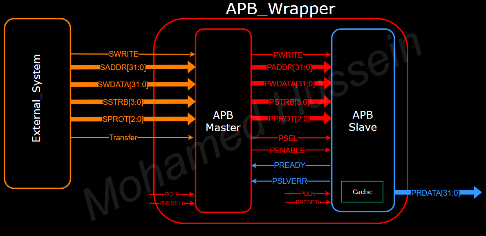

# AMBA APB4 Protocol

## Overview

The AMBA APB4 Protocol project implements the Advanced Peripheral Bus (APB) protocol, part of the AMBA (Advanced Microcontroller Bus Architecture) family. This protocol is designed to offer a low-complexity, low-power interface for communication with peripherals in modern System-on-Chip (SoC) designs. It is particularly suited for connecting low-speed peripherals such as timers, UARTs, GPIOs, and configuration registers, where high performance is not required.

## Repository Structure

- **RTL/**: Contains the Verilog source files for the APB master and slave modules.
- **Simulation/**: Includes the testbench files that simulate the external system, providing commands to the APB master and slave.
- **docs/**: Contains the project documentation, including references and the AMBA APB Protocol Specification.
- **Scripts/**: Provides script files, including a DO file for QuestaSim and a TCL file for Vivado, to enhance simulation and synthesis speed.
- **doc_3th_section/**: Contains synthesis reports, such as timing summaries and resource utilization.

## Protocol Architecture

**Main Idea:**
This project involves implementing the AMBA APB protocol, consisting of an APB master, an APB slave, and an external system (such as a CPU). The external system sends commands to the APB master, which then communicates these commands to the APB slave. Inside the APB slave, a cache memory is integrated to facilitate testing of write and read processes. The testbench simulates the external system, allowing for the verification of the protocol's functionality.

**Illustration:**


### Key Architectural Features:

- **Non-Pipelined Bus Interface**: Ensures straightforward communication with peripherals, minimizing complexity.
- **Single Clock Edge Operation**: Simplifies timing and reduces power usage, critical for battery-operated devices.
- **Three-State Control**: The protocol operates in three distinct states—IDLE, SETUP, and ACCESS—to manage data transfer efficiently.

## How to Use

### Simulation

1. **QuestaSim**:
   - Navigate to the `scripts/` directory.
   - Run the `run_questasim.do` file using the command:  
     ```sh
     vsim -do run_questasim.do
     ```
   - This will compile the Verilog files and execute the testbench.

2. **Vivado**:
   - Navigate to the `scripts/` directory.
   - Run the `run_vivado.tcl` file using the command:  
     ```sh
     vivado -mode batch -source run_vivado.tcl
     ```
   - This will compile the Verilog files and execute the synthesis and implementation steps.

### Testing

- The testbench, located in the `testbench/` directory, simulates the external system sending commands to the APB master.
- It verifies both write and read operations, checking the data integrity within the cache memory of the APB slave.
- The simulation also tests error scenarios, ensuring that the slave error signal (SLVERR) behaves as expected.

## Documentation

The project documentation is divided into four main parts:

1. **Introduction and Protocol Definition**: This section introduces the AMBA APB protocol and provides a detailed definition of its components and operation.
   
2. **Verification of Functionality**: This section includes wave snippets that demonstrate the successful operation of the protocol. It verifies the read and write processes, error handling, and overall communication between the APB master and slave.

3. **Comparison**: This section includes a comparison between the wave form in the Reference and the wave form created by by my tests in both writing and reading

4. **Implementation in Vivado**: This section details the process of implementing the design in Vivado. It explores the selection of the best encoding for the FSM (Finite State Machine), providing elaboration, synthesis, and implementation results for each encoding. The section also includes timing reports and utilization reports to assess the efficiency of the implementation.

## Speed Optimization

To enhance the efficiency of the simulation and synthesis processes, this repository includes both a **do file** and a **tcl file**. These scripts allow for rapid execution of commands in QuestaSim and Vivado, speeding up the development and verification processes.

## Getting Started

1. Clone the repository: git clone https://github.com/MohamedHussein27/AMPA_APB4_Protocol.git
2. Open the project in your preferred Verilog simulator (e.g., ModelSim or QuestaSim).
3. Use the provided '.do' file to run QuestaSim simulation and a '.tcl'to run the Vivado.
4. Refer to the comments in the code for detailed explanations of the functionality and flow.

## References

This project was developed with reference to the [AMBA APB Protocol Specification](https://www.eecs.umich.edu/courses/eecs373/readings/IHI0024C_amba_apb_protocol_spec.pdf), which provides detailed guidelines and standards for implementing the APB protocol.
